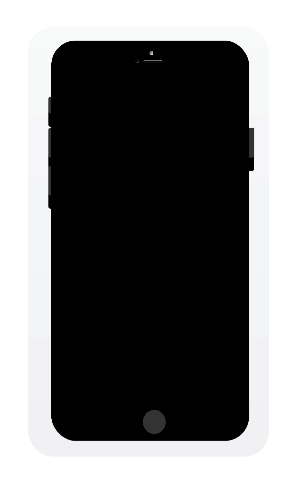

<p align="center">
    
</p>

<p align="center">
    
    
    <a href="https://travis-ci.org/LorTos/MatchTransition">
        
    </a>
    <a href="https://cocoapods.org/pods/MatchTransition">
        
    </a>
    
</p>

## What is this?

This pod allows you to easily create a transition between a cell (`UITableViewCell` or `UICollectionViewCell`) and a details `UIViewController` being presented modally.

## Example Project

To run the example project, clone the repo, and run `pod install` from the Example directory first.


<div align="center" >
    <!--  -->
    <!--  -->
    
</div>

## Usage

When presenting a details ViewController from a cell, after instantiating the controller...

```swift
let storyboard = UIStoryboard(name: "StoryboardName", bundle: nil)
let detailsViewController = storyboard.instantiateViewController(withIdentifier: "DetailsControllerIdentifier") as! DetailsControllerClass
```

and the cell...

```swift
let selectedCell = collectionView.cellForItem(at: indexPath) as! YourCellClass
```

setup your **MatchTransition**:

```swift
MatchTransitionManager.share.setup(cell: selectedCell, to: detailsViewController, with: [Match])
```

what is a `Match`? It's an object that connects two objects, one from the cell and the other from the details ViewController. To create one simply give it a *unique tag*, and pass the two objects:

```swift
Match(tag: "SomeUniqueName", from: selectedCell.someView, to: detailsViewController.someView)
```

Once you created all your matches simply call `present(detailsViewController, animated: true)` and let **MatchTransition** do the work!

## Tips

- Always add a `Match` between the cell's `contentView` and the detailsViewController `view`
- The order of your `Match`s in the array is *very important*! It determines the order in which the views are displayed in the transition, in front of or behind the others.

## Installation

MatchTransition is available through [CocoaPods](https://cocoapods.org). To install
it, simply add the following line to your Podfile:

```ruby
pod 'MatchTransition'
```

## Author

LorTos, lorenzotoscanidc@gmail.com

## License

MatchTransition is available under the MIT license. See the LICENSE file for more info.
