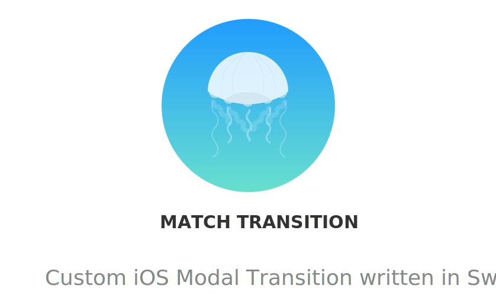

<p align="center">
    
</p>

<p align="center">
    
    
    <a href="https://travis-ci.org/LorTos/MatchTransition">
        
    </a>
    <a href="https://cocoapods.org/pods/MatchTransition">
        
    </a>
    
</p>

## What is this?

This pod allows you create a custom transition between:
  - a cell (`UITableViewCell` or `UICollectionViewCell`) and a details `UIViewController`
  - two `UIViewController`

Using both a modal `present(UIViewController, animated: Bool, completion: nil)` or a `UINavigationController` push.

## Example Project

The project contains an example of each type of transition. To run the example project, clone the repo, and run `pod install` from the Example directory.

<div align="center" >
    
    
</div>


## Usage

Create a transition manager in the viewController where you want the transition to start.
```swift
let manager = MatchTransitionManager()
```
Once you want to push or present a new `UIViewController`, instantiate it:

```swift
let storyboard = UIStoryboard(name: "StoryboardName", bundle: nil)
let detailsViewController = storyboard.instantiateViewController(withIdentifier: "DetailsControllerIdentifier") as! DetailsControllerClass
```

- ### Setup from *Cell* to details *UIViewController*

When you want the animation to start from a cell, get the selectedCell:

```swift
let selectedCell = collectionView.cellForItem(at: indexPath) as! YourCellClass
```

setup your `[Match]`:

```swift
let matches: [Match] = [
  Match(tag: "SomeUniqueName", from: selectedCell.someView, to: detailsViewController.someView),
  Match(tag: "OtherName", from: selectedCell.otherView, to: detailsViewController.otherView),
]
```

setup your **MatchTransition**:

```swift
manager.setupTransition(from: selectedCell,
                        inside: self,
                        to: detailsViewController,
                        with: matches,
                        transitionType: TransitionType)
```

- ### Setup from *UIViewController* to *UIViewController*

Create your `[Match]` between views of your current `UIViewController`(self) and the details `UIViewController`:

```swift
let matches: [Match] = [
  Match(tag: "SomeUniqueName", from: self.someView, to: detailsViewController.someView),
  Match(tag: "OtherName", from: self.otherView, to: detailsViewController.otherView),
]
```

setup your **MatchTransition**:

```swift
manager.setupTransition(from: self,
                        to: destinationVC,
                        with: matches,
                        transitionType: TransitionType)
```


- ### Choosing *TransitionType* and starting the transition

When setting up the `MatchTransition` you have to pass a `TransitionType`,
which can either be `.modal` or `.push`.
  - `.modal` requires no further setup:

    1. Simply call `present(detailsViewController, animated: true)` and let **MatchTransition** do the work!

  - `.push` requires some more steps for everything to work smoothly:
    1. Both `UIViewController` involved in the transition must have the **same** copy of `MatchTransitionManager`

    2. In the `viewDidAppear()` of each controller set the `navigationController?.delegate = self`
    3. Conform to `UINavigationControllerDelegate` in both controllers,
    depending on which `operation` you want the transition to happen, return the corresponding transition from the manager.
    Then for all other cases set the delegate to nil and return nil:
    ```Swift
    func navigationController(_ navigationController: UINavigationController, animationControllerFor operation: UINavigationController.Operation, from fromVC: UIViewController, to toVC: UIViewController) -> UIViewControllerAnimatedTransitioning? {
          if operation == .push {
              return manager.transition(for: .presenting)
          }
          navigationController.delegate = nil
          return nil
    }
    ```
    4. You can now call `push(detailsViewController, animated: true)` and enjoy the transition!

## FAQ

- What is a `Match`?
It's an object that connects two views, one from the initial ViewController or cell, and the other from the details ViewController.
To create one simply give it a *unique tag*, and pass the two views:

```swift
Match(tag: "SomeUniqueName", from: selectedCell.someView, to: detailsViewController.someView)
```

## Tips

- Always add a `Match` between the cell's `contentView` and the detailsViewController `view`

- The order of your `Match` in the array is *very important*! It determines the order in which the views are displayed in the transition, in front of or behind the others

- In the case of a transition of type `.push`, both controllers must have the **same** instance of the manager

## Installation

MatchTransition is available through [CocoaPods](https://cocoapods.org). To install
it, simply add the following line to your Podfile:

```ruby
pod 'MatchTransition'
```

and run `pod install`.

## Author

LorTos, lorenzotoscanidc@gmail.com

## License

MatchTransition is available under the MIT license. See the LICENSE file for more info.
