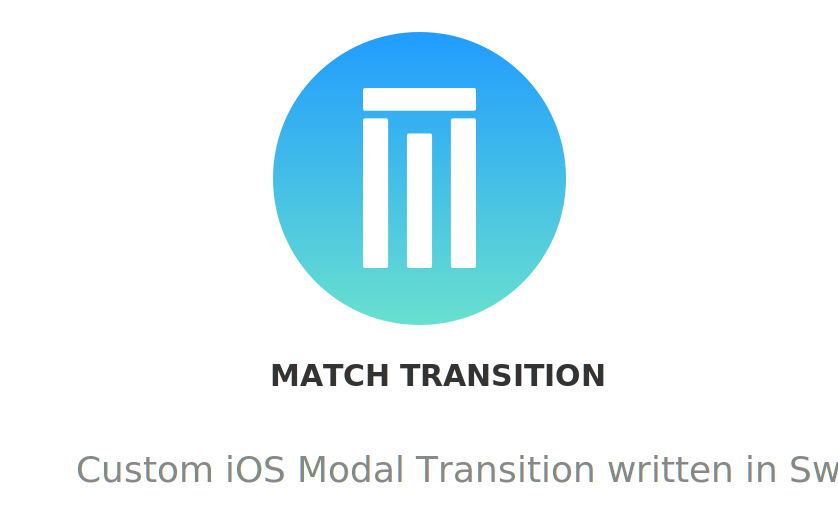

<p align="center">
    
</p>

<p align="center">
    
    
    <a href="https://travis-ci.org/LorTos/MatchTransition">
        
    </a>
    <a href="https://cocoapods.org/pods/MatchTransition">
        
    </a>
    
</p>

## Example

To run the example project, clone the repo, and run `pod install` from the Example directory first.

## Requirements

## Installation

MatchTransition is available through [CocoaPods](https://cocoapods.org). To install
it, simply add the following line to your Podfile:

```ruby
pod 'MatchTransition'
```

## Author

LorTos, lorenzotoscanidc@gmail.com

## License

MatchTransition is available under the MIT license. See the LICENSE file for more info.
